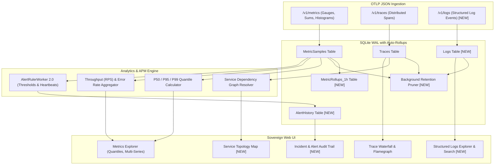

# Architectural Plan: Advancing KestrelScope to Enterprise-Grade Sovereign Observability

## Overview & Background

KestrelScope was engineered as a 100% sovereign, self-hosted, single-binary observability platform with zero external SaaS dependencies, built on .NET 9 and embedded SQLite in Write-Ahead Logging (WAL) mode.

Having successfully completed the core foundation (OTLP Metrics `/v1/metrics`, Distributed Traces `/v1/traces`, alert rules engine, session auth, air-gapped web UI, and containerized E2E test suite), this plan outlines an industry-aligned roadmap inspired by Google SRE principles (The 4 Golden Signals), OpenTelemetry Semantic Conventions, and best-in-class modern observability platforms (Grafana/Prometheus/Tempo, SigNoz, Datadog).

---

## Industry Standards Analysis & Feature Gaps

| Capability Area | Industry Standard (OpenTelemetry / SRE) | KestrelScope Current State | Proposed Enhancement |
| :--- | :--- | :--- | :--- |
| **Telemetry Pillars** | Metrics, Traces, and **Structured Logs** (The 3 Pillars) | Metrics and Traces only | Add **OTLP Logs Ingestion (`/v1/logs`)** with bidirectional trace correlation |
| **Metric Math & Semantics** | **Golden Signals**: Latency Quantiles (P50, P90, P95, P99), Traffic (RPS), Error Rate (%), Saturation | Raw points and simple average `AVG(Value)` | Implement statistical quantiles, throughput calculations, and error rate tracking |
| **Service Topology** | Dynamic Service Dependency Graph (service-to-service calls) | Flat list of services in dropdowns | Auto-inferred **Service Topology Map** based on parent-child span boundaries |
| **Trace Visualization** | Waterfall + Flamegraphs + Critical Path Analysis | Linear span list & simple bar waterfall | Enhanced interactive waterfall, flamegraph toggle, and span tag/attribute inspector |
| **Alerting & Incidents** | Incident audit trail, rich multi-channel webhooks (Slack/Discord/Pager), heartbeats | Single webhook dispatch, no history table | **Alerting 2.0**: Firing/resolved incident history table, deadman switches, rich JSON templates |
| **Storage & Retention** | Automated data tiering, rollups, and pruning | Unbounded SQLite table growth | **Data Lifecycle Engine**: Auto-retention pruning, 1-minute and 1-hour metric downsampling rollups |

---

## Proposed Roadmap & Architectural Design



---

## Proposed Phases & Deliverables

### Phase 1: The Third Pillar — Structured Logging (`/v1/logs`) & Correlation
Logs provide the fine-grained execution context needed to diagnose *why* a specific trace or metric anomaly occurred.
1. **Database Schema**:
   - Create `Logs` table:
     ```sql
     CREATE TABLE IF NOT EXISTS Logs (
         Id INTEGER PRIMARY KEY AUTOINCREMENT,
         Timestamp DATETIME NOT NULL,
         TraceId TEXT,
         SpanId TEXT,
         ServiceName TEXT NOT NULL,
         SeverityText TEXT NOT NULL,
         SeverityNumber INTEGER NOT NULL,
         Body TEXT NOT NULL,
         AttributesJson TEXT
     );
     CREATE INDEX IF NOT EXISTS idx_logs_lookup ON Logs(ServiceName, Timestamp);
     CREATE INDEX IF NOT EXISTS idx_logs_trace ON Logs(TraceId);
     ```
2. **OTLP Ingestion (`POST /v1/logs`)**:
   - Parse OpenTelemetry standard JSON payloads containing `resourceLogs`, `scopeLogs`, and `logRecords`.
   - Batch insert into SQLite inside a single WAL transaction.
3. **Trace-to-Log Correlation**:
   - When inspecting a trace in `traces.html`, clicking "View Logs" filters the logs explorer for that specific `TraceId`.
4. **Logs Explorer UI (`logs.html`)**:
   - Real-time log stream with level filtering (`DEBUG`, `INFO`, `WARN`, `ERROR`), text search, and time range scoping.

---

### Phase 2: Golden Signals & Advanced Metric Math (Quantiles, RPS, Error Rates)
Industry standards (Google SRE) discourage using simple averages for request duration because averages conceal the long-tail latency spikes that degrade user experience.
1. **Percentile / Quantile Metrics**:
   - Add analytical SQL functions for $P_{50}$, $P_{90}$, $P_{95}$, and $P_{99}$ latency distributions across time buckets.
2. **Requests Per Second (RPS) & Error Rates**:
   - Calculate instantaneous throughput: $\text{RPS} = \frac{\Delta \text{Count}}{\Delta t}$.
   - Calculate error percentage: $\text{ErrorRate} = \frac{\text{Failed Requests}}{\text{Total Requests}} \times 100\%$.
3. **Dashboard Visualizations (`dashboard.html`)**:
   - Multi-metric overlays: Display P50, P95, and P99 as stacked or multi-line curves on a single chart.
   - Summary stat cards: Current RPS, P95 Latency, Error Rate %, and Active Services.

---

### Phase 3: Service Topology Map & Flamegraph APM
Understanding how microservices interact across complex distributed transactions is essential for modern architectures.
1. **Dynamic Service Dependency Graph**:
   - In microservices, when service $A$ makes an HTTP/gRPC call to service $B$, the child span records service $B$ with `parentSpanId` pointing to service $A$'s span.
   - Query:
     ```sql
     SELECT DISTINCT p.ServiceName AS Source, c.ServiceName AS Target, COUNT(*) AS CallCount, AVG(c.DurationMs) AS AvgLatency
     FROM Traces c
     JOIN Traces p ON c.ParentSpanId = p.SpanId
     WHERE c.ServiceName != p.ServiceName AND c.Timestamp >= @windowStart
     GROUP BY p.ServiceName, c.ServiceName;
     ```
   - Render an interactive, air-gapped node graph (via SVG / HTML5 Canvas) in a new **Service Map** tab (`topology.html` or embedded in `traces.html`), showing request flows and error hotspots.
2. **Trace Flamegraph View**:
   - In `traces.html`, provide a toggle between the current hierarchical waterfall and a flamegraph visualization showing time spent in downstream dependencies.

---

### Phase 4: Alerting 2.0 & Incident Audit Trail
Alerting without historical tracking creates blind spots.
1. **Incident Audit Trail Table (`AlertHistory`)**:
   - Record every trigger and recovery event:
     ```sql
     CREATE TABLE IF NOT EXISTS AlertHistory (
         Id INTEGER PRIMARY KEY AUTOINCREMENT,
         RuleId INTEGER NOT NULL,
         RuleName TEXT NOT NULL,
         ServiceName TEXT NOT NULL,
         MetricValue REAL NOT NULL,
         Threshold REAL NOT NULL,
         State TEXT NOT NULL, -- 'FIRING', 'RESOLVED'
         TriggeredAt DATETIME NOT NULL,
         ResolvedAt DATETIME
     );
     ```
2. **Alert Management Enhancements (`alerts.html`)**:
   - Dedicated "Incident History" tab showing recent alarms, breach values, duration, and resolution status.
   - Support for threshold conditions: `>` (greater than), `<` (less than, e.g. for low throughput), and deadman switches (no telemetry received for $N$ minutes).
3. **Multi-Channel Webhook Payloads**:
   - Standardize JSON payloads with ready-to-use formatting for Slack, Discord, Microsoft Teams, and custom webhooks.

---

### Phase 5: Storage Lifecycle, Rollup Downsampling, & SQLite Pruning
Unbounded telemetry ingestion in long-running deployments will eventually exhaust disk space.
1. **Automated Downsampling Rollups**:
   - Raw high-frequency metric points are consolidated into hourly rollups (`Min`, `Max`, `Avg`, `Count`) after 24 hours:
     ```sql
     CREATE TABLE IF NOT EXISTS MetricRollups_1h (
         Id INTEGER PRIMARY KEY AUTOINCREMENT,
         ServiceName TEXT NOT NULL,
         MetricName TEXT NOT NULL,
         BucketStart DATETIME NOT NULL,
         AvgValue REAL NOT NULL,
         MinValue REAL NOT NULL,
         MaxValue REAL NOT NULL,
         SampleCount INTEGER NOT NULL
     );
     ```
2. **Configurable Retention Policy**:
   - Config in `appsettings.json`:
     ```json
     "Retention": {
       "RawMetricsDays": 7,
       "HourlyRollupsDays": 90,
       "TracesDays": 14,
       "LogsDays": 14
     }
     ```
   - Background worker runs once daily to delete expired records and execute `PRAGMA incremental_vacuum;` or `PRAGMA optimize;`.

---

## User Review Required

> [!IMPORTANT]
> **Implementation Phasing**:
> All proposed features maintain 100% adherence to sovereign, single-binary architecture with zero external runtime dependencies.
> Which phase or feature would you like to prioritize first?
> 1. **Phase 1: OpenTelemetry Logs (`/v1/logs`) & Trace-to-Log Correlation**
> 2. **Phase 2: Golden Signals & Percentiles (P50, P95, P99, RPS, Error Rates)**
> 3. **Phase 3: Service Topology Dependency Map & Flamegraphs**
> 4. **Phase 4: Alerting 2.0 & Incident Audit Trail**
> 5. **Phase 5: Storage Lifecycle, Downsampling Rollups, & Data Retention**

---

## Verification Plan

### Automated Testing
- Extend `tests/SampleOrderService` to emit sample logs, quantile histograms, and multi-service trace hops.
- Extend `KestrelScope.EndToEndTests` to validate each newly added API endpoint and UI route.
- Run test suite against Docker Compose environment to ensure 100% pass rate.

### Manual Verification
- Visual inspection of the updated dashboards, topology diagrams, and incident history tables.
- Verification of database pruning and rollup generation.

